# A2A MCP App: A Multi-Agent System with Advanced MongoDB Memory

[](https://www.mongodb.com/)
[](https://github.com/google/agent-development-kit)
[](https://deepmind.google/technologies/gemini/)
[](https://www.python.org/downloads/)
[](https://opensource.org/licenses/Apache-2.0)
[](https://www.langchain.com/)
[](https://langchain-ai.github.io/langgraph/)

This project demonstrates a sophisticated Agent-to-Agent (A2A) communication system built with **LangGraph**, featuring advanced, multi-layered memory powered by **MongoDB**. The architecture includes a central routing agent, specialized support and scheduling agents, and a dedicated MCP (Model-centric Communication Protocol) server for managing meeting schedules.

This system is an evolution of Google's a2a-adk-app sample, integrating state-of-the-art agentic AI patterns.

## ✨ Key Features

- **Advanced Memory Architecture**:
  - **Persistent Conversations**: Resume conversations exactly where they left off using `MongoDBSaver` checkpoints.
  - **Semantic Memory**: Intelligent retrieval of relevant past interactions using vector embeddings with `MongoDBStore`.
  - **Autonomous Context Management**: `langmem` automatically manages and recalls important information across conversations.
- **Modern Agent Framework**:
  - **LangGraph ReAct**: Agents capable of multi-step reasoning and dynamic tool use.
  - **A2A Integration**: Full compatibility with Google's Agent-to-Agent (A2A) framework.
- **Scalable & Extensible Architecture**:
  - **MongoDB Backend**: A robust, unified backend for both operational data (schedules) and agent memory.
  - **MCP Integration**: An extensible tool system via the Model-centric Communication Protocol.
  - **Microservices Design**: Independent, specialized agents for improved maintainability and scalability.

## 🏛️ Architecture Overview

The system is composed of several independent services that communicate to fulfill user requests.

```mermaid
graph TD
    User[👤 User] --> UIAgent["💻 Host Agent / UI (Gradio)"]
    UIAgent --> RoutingAgent["🧠 Routing Agent (ADK)"]
    
    subgraph "Specialized Agents (LangGraph)"
        RoutingAgent -- "Support Task" --> SupportAgent["💬 Support Agent"]
        RoutingAgent -- "Scheduling Task" --> SchedulingAgent["📅 Scheduling Agent"]
    end

    subgraph "Tool & Memory Infrastructure"
        SchedulingAgent -->|"Uses Tools via MCP"| SchedulingAgentMCP["🛠️ Scheduling MCP Server (FastMCP)"]
        SupportAgent -->|"Memory & Tools"| MemorySystem
        SchedulingAgent -->|"Memory & Tools"| MemorySystem
    end

    subgraph "Data & Memory Persistence (MongoDB)"
        SchedulingAgentMCP -- "CRUD Operations" --> MongoDBDatastore["(Collection: meeting_slots)"]
        MemorySystem -- "Checkpoints & Vectors" --> MongoDBMemoryDB["(Collections: checkpoints, memory_store)"]
    end

    style User fill:#f9f,stroke:#333,stroke-width:2px
    style UIAgent fill:#bbf,stroke:#333,stroke-width:2px
    style RoutingAgent fill:#lightgrey,stroke:#333,stroke-width:2px
    style SupportAgent fill:#9f9,stroke:#333,stroke-width:2px
    style SchedulingAgent fill:#9f9,stroke:#333,stroke-width:2px
    style SchedulingAgentMCP fill:#9cf,stroke:#333,stroke-width:2px
    style MemorySystem fill:#f96,stroke:#333,stroke-width:2px
    style MongoDBDatastore fill:#ff9,stroke:#333,stroke-width:2px
    style MongoDBMemoryDB fill:#ff9,stroke:#333,stroke-width:2px
```



1.  **User Interaction**: The user interacts with a Gradio web UI, which is served by the **Host Agent**.
2.  **Routing Agent**: The Host Agent passes the request to the ADK-based **Routing Agent**. This agent's sole purpose is to determine the user's intent and delegate the task to the appropriate specialized agent.
3.  **Specialized LangGraph Agents**:
    *   **Support Agent**: Handles general queries and provides information using its knowledge base.
    *   **Scheduling Agent**: Manages calendar events by interacting with a set of scheduling tools.
    *   Both agents are built with LangGraph's ReAct architecture, using Google's `gemini-2.5-flash` model.
4.  **Scheduling MCP Server**: A `fastmcp` server exposes tools for managing meeting schedules (e.g., `schedule_meeting`, `get_free_slots`). It uses MongoDB as its data store.
5.  **MongoDB Memory System**: The LangGraph agents are equipped with a sophisticated, multi-layered memory system, all persisted in MongoDB:
    *   **`MongoDBSaver`**: Stores full conversation state checkpoints, allowing agents to be stateless and conversations to be resilient.
    *   **`MongoDBStore`**: Creates a vector index of conversational history for semantic search, enabling agents to recall relevant context from the past.
    *   **`langmem`**: Provides an intelligent memory management tool that agents can use to explicitly store and retrieve important facts.

## 📂 Project Structure

```
.
├── a2a_agents/              # Main source package (legacy name)
├── common/                  # Shared code for LangGraph agents
│   ├── langgraph_agent.py   # Factory for creating memory-enabled LangGraph agents
│   └── ...
├── host_agent/              # The main UI and routing agent
│   ├── adk_agent/           # ADK-based routing agent logic
│   └── app.py               # Gradio web application
├── mcp/                     # The scheduling tool server
│   └── main.py              # FastMCP server exposing scheduling tools
├── scheduling_agent/        # The specialized agent for scheduling
│   └── main.py
├── support_agent/           # The specialized agent for support queries
│   └── main.py
├── scripts/                 # Utility scripts
│   ├── start_services.sh    # Starts all services
│   └── kill_ports.sh        # Stops all services
├── .env.example             # Master example environment file
├── pyproject.toml           # Project dependencies
└── README.md                # You are here!```

## 🚀 Getting Started

### 1. Prerequisites

- Python 3.11+
- uv (recommended) or `pip`
- A MongoDB instance (e.g., a free cluster on MongoDB Atlas)
- API keys for Google AI and Voyage AI.

### 2. Installation

Clone the repository and install the dependencies.

```bash
git clone https://github.com/your-username/A2A-MCP-App-A-Multi-Agent-System-with-Advanced-MongoDB-Memory.git
cd A2A-MCP-App-A-Multi-Agent-System-with-Advanced-MongoDB-Memory

# Using uv (recommended)
uv sync

# Or using pip
pip install -e .
```

### 3. Environment Configuration

The project uses a single `.env` file at the root of the project for configuration. This file is intentionally not checked into version control (see `.gitignore`).

To set up your environment, copy the example file and fill in your credentials:

```bash
cp .env.example .env
```

Now, edit your new `.env` file:
```bash
# .env

# MongoDB connection string for memory and data persistence
MONGODB_URI="mongodb+srv://<username>:<password>@<your-cluster-url>/?retryWrites=true&w=majority"

# API key for Google's Gemini models
GOOGLE_API_KEY="your-google-api-key"

# API key for Voyage AI embedding models
VOYAGE_API_KEY="your-voyageai-api-key"

# --- Agent & Server URLs (defaults are usually fine for local dev) ---
# The startup scripts manage ports, so you typically don't need to change these.
MEETING_SCHEDULE_MCP="http://localhost:8000/sse"
SCHEDULING_AGENT_URL="http://localhost:8001"
SUPPORT_AGENT_URL="http://localhost:8002"```

### 4. Run the Services

A convenience script is provided to start all the necessary services in separate terminal windows (macOS only). For other OSes, you can run the commands inside the script manually in different terminals.

```bash
# This will open 4 new terminal windows for each service
./scripts/start_services.sh
```

To stop all services, press `Ctrl+C` in the terminal where you ran the script, or run:
```bash
./scripts/kill_ports.sh
```

### 5. Access the Application

Once all services are running, you can access the Gradio UI in your browser:

**➡️ http://localhost:8083**


## 🔧 Technical Deep Dive: MongoDB Integration

MongoDB is the backbone of this system, serving two distinct but critical roles:

### 1. Transactional Data Store for MCP Tools

- **Implementation**: The `fastmcp` server (`mcp/main.py`) uses the `motor` async driver to perform CRUD operations on meeting slots.
- **Database & Collection**: `agent_memory` / `meeting_slots`
- **Functionality**: The `schedule_meeting` and `get_free_slots` tools directly interact with this collection, treating it as a standard operational database.

### 2. Multi-Layered Agent Memory System

- **Implementation**: The `common/langgraph_agent.py` file configures a sophisticated memory system for the LangGraph agents.
- **Database**: `agent_memory`
- **Collections**:
  - `a2a_thread_checkpoints`: Stores conversation state checkpoints via `MongoDBSaver`. This provides **resilience** and **persistence**.
  - `a2a_memory_store`: Stores vector embeddings of conversation snippets via `MongoDBStore`. This provides **semantic search** capabilities.
- **Vector Search**: The system uses Voyage AI's `voyage-3.5` model for embeddings and leverages MongoDB's built-in vector search capabilities for efficient, intelligent memory retrieval.

```mermaid
graph TD
    subgraph "Application Components"
        LangGraphAgent["🤖 LangGraph Agent"]
        SchedulingTools["🛠️ Scheduling Tools (via MCP Server)"]
    end

    %% Agent Memory Flow
    LangGraphAgent --> |"Stores full state"| MongoDBSaver["MongoDBSaver"]
    LangGraphAgent --> |"Retrieves context"| MongoDBStore["MongoDBStore (Vector Search)"]
    LangGraphAgent --> |"Manages facts"| LangMemTool["langmem Tool"]

    %% MCP Data Flow
    SchedulingTools --> |"CRUD Operations"| MotorDriver["Motor Async Driver"]

    subgraph "MongoDB Instance: agent_memory"
        direction TB
        CheckpointCollection["(Collection: a2a_thread_checkpoints)"]
        VectorCollection["(Collection: a2a_memory_store)"]
        MeetingCollection["(Collection: meeting_slots)"]
    end

    %% Connections to MongoDB
    MongoDBSaver --> CheckpointCollection
    MongoDBStore --> VectorCollection
    LangMemTool --> VectorCollection
    MotorDriver --> MeetingCollection

    %% Styling
    style LangGraphAgent fill:#9f9,stroke:#333,stroke-width:2px
    style SchedulingTools fill:#9cf,stroke:#333,stroke-width:2px
    style MongoDBSaver fill:#f96,stroke:#333,stroke-width:2px
    style MongoDBStore fill:#f96,stroke:#333,stroke-width:2px
    style LangMemTool fill:#6f9,stroke:#333,stroke-width:2px
    style MotorDriver fill:#c9f,stroke:#333,stroke-width:2px
    style CheckpointCollection fill:#ff9,stroke:#333,stroke-width:2px
    style VectorCollection fill:#ff9,stroke:#333,stroke-width:2px
    style MeetingCollection fill:#ff9,stroke:#333,stroke-width:2px
```



## 📄 License

This project is licensed under the Apache 2.0 License. See the LICENSE file for details.
